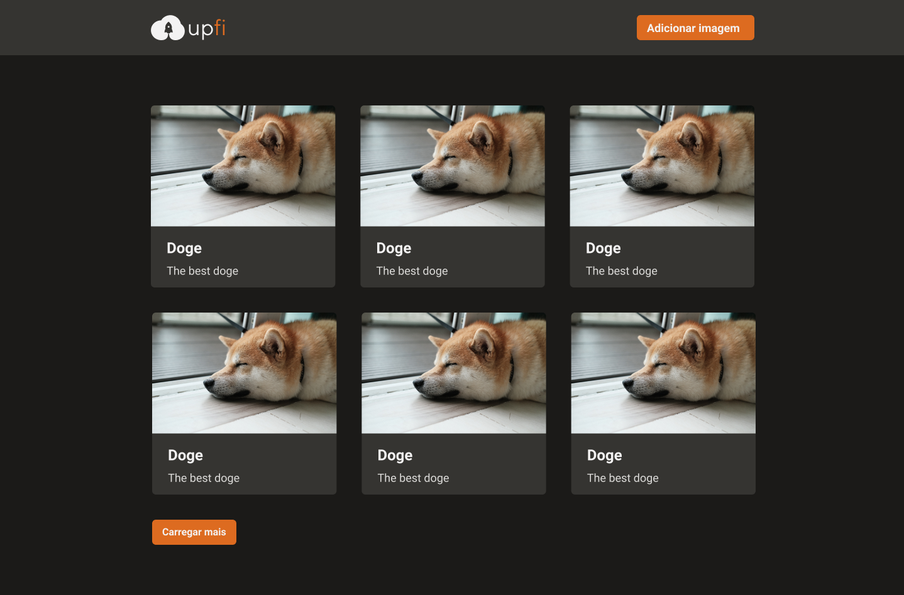
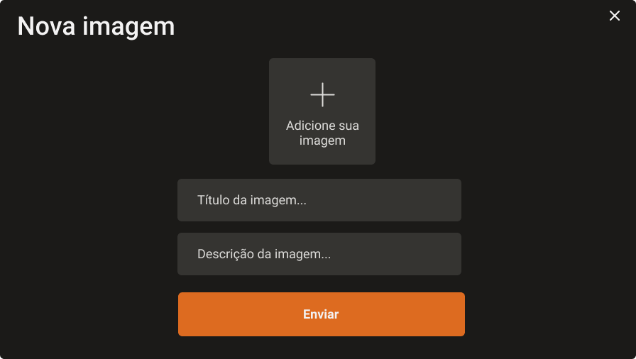

# Reactjs Ignite Uploadde Imagens

## Resumo e descrição do projeto

Desafio do Bootcamp Ignite, pela empresa Rocketseat. 

----

Começando pelo tema do projeto: upload de imagens. Como o desenvolvimento do zero acarretaria em um projeto muito grande, fornecemos no template a maior parte do projeto já implementada para que você tenha que trabalhar apenas com 4 arquivos. A ideia é que nesses 4 arquivos você tenha um pouco de contato com os 3 principais pontos que queremos abordar nesse projeto: React Query, React Hook Form e Chakra UI.

Dessa forma, antes de ir diretamente para o código do desafio, explicaremos brevemente como cada um dos pontos abaixo são importantes para o desafio:

---

## Fotos

---

## Tecnologias

Este projeto foi feito utilizando as seguintes tecnologias:

- [React](https://reactjs.org/)
- [Typescript](https://www.typescriptlang.org/)
- [NextJS](https://nextjs.org/)
- [Chakra UI](https://chakra-ui.com/)
- [Axios](https://github.com/axios/axios)
- [FaunaDB](https://dashboard.fauna.com)
- [ImgBB](https://imgbb.com)
- [React Query](https://react-query.tanstack.com)
- [React Hook Form](https://react-hook-form.com)
- [Figma](https://www.figma.com/file/1kk0vnDgJnn7Si39fb9UFX/Desafio-2-M%C3%B3dulo-4-ReactJS-(Copy)?node-id=0%3A1
)

